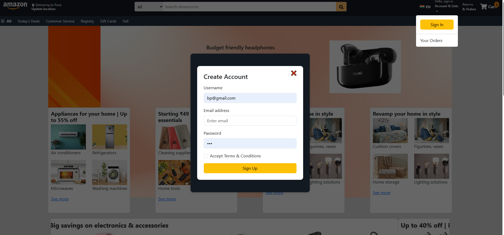
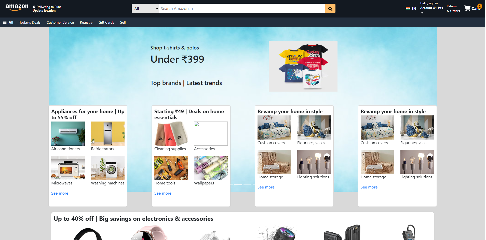
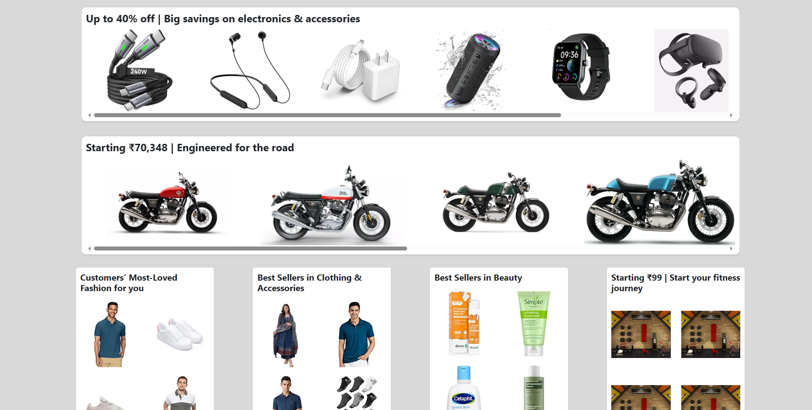
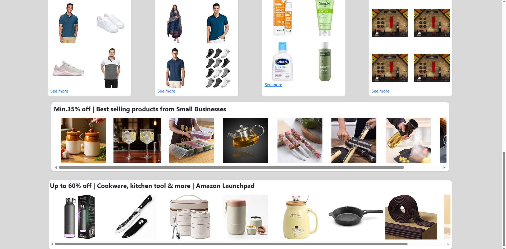

# 🛒 Amazon Clone - React.js

A responsive e-commerce frontend inspired by Amazon, built using React.js and Bootstrap 5.

---

## 🚀 Features
- Responsive design (mobile-first)
- Product listing UI
- Search and filtering functionality
- Reusable components (Navbar, Product Cards)

---

## 🛠 Tech Stack
- React.js
- Bootstrap 5
- HTML5
- CSS3
- JavaScript (ES6)

---

## ⚙️ Installation & Setup

git clone https://github.com/your-username/amazon-clone-react.git  
cd amazon-clone-react  
npm install  
npm start  

---

## 📸 Screenshots

  

  

  

  

---

## 🔗 GitHub Repository
https://github.com/Bhumika1104

---

## 👩‍💻 Author
Bhumika Patil

---
